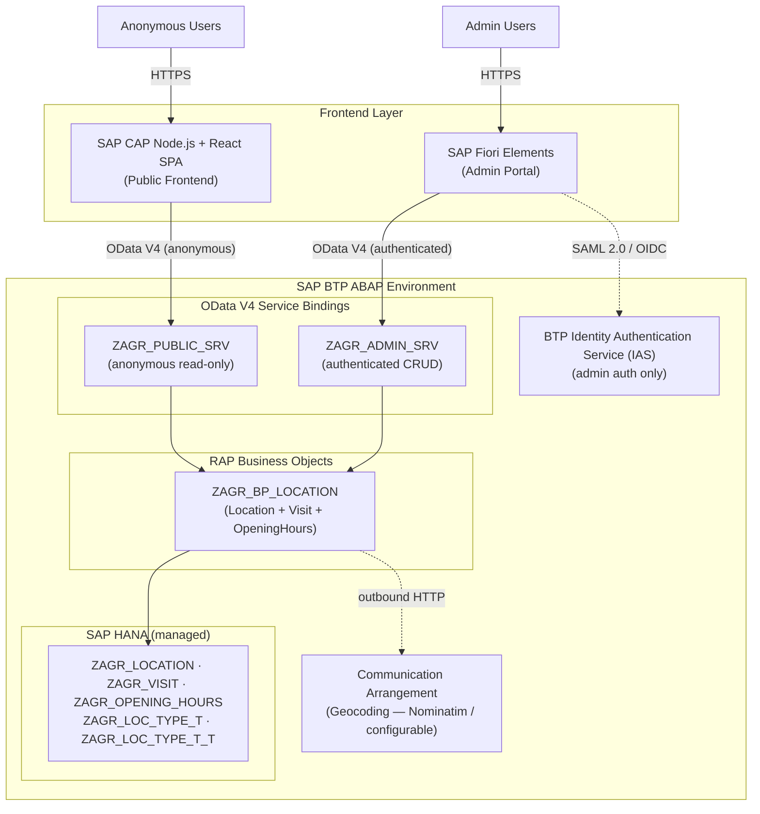
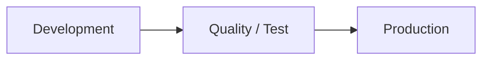

# Agora — Architecture

> **Version:** 3.1 | **Status:** AUTHORITATIVE

---

## 1. System Overview

### Access Modes

The system implements two distinct access modes:

| Mode | Users | Authentication | Scope | Interface |
|---|---|---|---|---|
| **Admin** | Authenticated admin principals | BTP IAS (SAML 2.0 / OIDC) + ABAP authorization object `ZAGR_LOC` | Full CRUD on all entities, Tholos dashboard | SAP Fiori Elements → `ZAGR_ADMIN_SRV` |
| **Anonymous** | Any unauthenticated user | None | Read-only: Periplus, Pothos, Pinax | SAP CAP Node.js (proxy) → `ZAGR_PUBLIC_SRV` |

The CAP Node.js application is a **pure proxy**: it serves the React SPA and forwards OData read requests to `ZAGR_PUBLIC_SRV` on the ABAP backend. It does not define its own CDS entities or own data layer. All data access — for both modes — is served by the RAP Business Objects on the ABAP system.

### Component Diagram



### Service Boundaries

- The RAP framework is the **sole** layer that reads and writes SAP HANA. There is no separate API process or middleware tier.
- **Admin interface**: SAP Fiori Elements apps are metadata-driven and generated from CDS annotations. No custom SAPUI5 controller code is required for standard List Report / Object Page flows.
- **Anonymous interface**: SAP CAP Node.js application provides a React-based SPA that proxies OData read requests to `ZAGR_PUBLIC_SRV`. Anonymous users can browse Periplus (visited locations), Pothos (wish-list), and Pinax (map). No authentication is required and no write endpoints are exposed.
- SAP BTP IAS manages all admin authentication and session tokens. No application code handles passwords, tokens, or session state.
- Geocoding calls are made **outbound from the ABAP backend** to an external geocoding service (default: Nominatim). The connection is configured via a Communication Arrangement in the BTP ABAP environment. There is no geocoding logic in the CAP application.
- There is no file storage layer. Image handling is out of scope.

---

## 2. Request Data Flows

**1. Admin creates a location**

Fiori Elements List Report (Create button) → OData POST to `ZAGR_ADMIN_SRV/.../Location` → RAP framework routes to `MODIFY` method of `ZAGR_BP_LOCATION` → behavior implementation validates required fields, checks authorization object `ZAGR_LOC` activity `02` (Create) → inserts row into `ZAGR_LOCATION` → RAP `AFTER SAVE` phase triggers auto-geocoding: behavior implementation resolves HTTP client from Communication Arrangement, calls geocoding service with address fields → on success: `Latitude`, `Longitude`, `GeoResolved = X` written back → OData response `201 Created` with the new entity including `LocationUuid`, `CreatedAt`, `LastChangedAt` (ETag value).

**2. Admin updates ratings (OverallScore recomputation)**

Fiori Elements Object Page (Save after editing ratings) → OData PATCH on `Location` entity → `If-Match` ETag header required → RAP `MODIFY` method detects that `PriceRating`, `AmbienceRating`, or `QualityRating` is in the changed field set → behavior implementation checks each rating for the initial value (unset) → if all three are set: `OverallScore = (price + ambience + quality) / 3`; if any is unset: `OverallScore = null` → both the changed ratings and the new `OverallScore` are persisted in the same RAP SAVE sequence. No separate or asynchronous step.

**3. Anonymous user browses Periplus, Pothos, or Pinax**

Browser loads the React SPA served by the CAP Node.js application → React app makes API calls to CAP proxy endpoints → CAP proxy translates to OData and forwards to `ZAGR_PUBLIC_SRV` (anonymous binding, no authentication required) → RAP framework evaluates CDS access control (DCL grants unrestricted read) → returns data:

- **Periplus**: `$filter=Status eq 'VISITED'&$orderby=LastChangedAt desc` — visited location list and detail with Visit and OpeningHours child entities
- **Pothos**: `$filter=Status eq 'WISHLIST'&$orderby=CreatedAt desc` — wish-list entries
- **Pinax**: `$filter=Status ne 'CLOSED'&$select=LocationUuid,Name,LocType,Status,Latitude,Longitude,OverallScore` — all non-closed locations with coordinates for map rendering; React SPA further filters out records with null coordinates client-side and calculates pin colours from `LocType.BaseColor` using HSL

`Visit` entities are returned from `ZAGR_C_VISIT_PUB` projection, which structurally excludes `AdminUserId`. No write actions are available on the public service.

**4. Wish-list promotion (Pothos → Periplus)**

Admin triggers the "Promote to Periplus" action on the Location Object Page → Fiori Elements sends OData POST to `.../Location(guid)/com.sap.zagr.promote` → RAP routes to the bound action method in `ZAGR_BP_LOCATION` → action validates `Status = 'WISHLIST'` (raises HTTP 422 if already `VISITED` or `CLOSED`) → sets `Status = 'VISITED'`, updates `LastChangedAt` → returns the updated `Location` entity → Fiori Elements refreshes the Object Page.

**5. Admin views Tholos (dashboard)**

Admin navigates to the Tholos Fiori app → app calls `GET .../GetDashboardStats()` on `ZAGR_ADMIN_SRV` → RAP function implementation executes five HANA aggregation queries (COUNT for totals, MAX visit count per location, MAX `OverallScore` excluding nulls) → returns a single structured result → Fiori Elements renders the analytics strip and two sorted location lists.

**6. Admin triggers re-geocode**

Admin selects a location missing coordinates and clicks "Re-geocode" → Fiori Elements sends OData POST to `.../Location(guid)/com.sap.zagr.reGeocode` → RAP routes to the bound action in `ZAGR_BP_LOCATION` → behavior implementation calls geocoding service via Communication Arrangement HTTP client → on success: `Latitude`, `Longitude` written, `GeoResolved = X`, warning indicator cleared; on failure: coordinates remain null, warning indicator remains → returns updated `Location` entity.

---

## 3. Security

### 3.1 Authentication — BTP Identity Authentication Service (IAS)

All admin users authenticate via SAP BTP IAS using SAML 2.0 or OIDC federation between IAS and the BTP ABAP system. The Fiori Elements app is registered as an application in IAS. Token lifetimes, session management, and refresh are governed by IAS configuration — no application code handles these concerns. Public read access requires no authentication.

### 3.2 Authorization — ABAP Authorization Objects and BTP Role Collections

One custom ABAP authorization object is defined:

| Object | Field | Allowed Activities |
|---|---|---|
| `ZAGR_LOC` | `ACTVT` | `01` Read, `02` Create, `03` Change/Update, `06` Delete |

A PFCG role `ZAGR_ADMIN_ROLE` grants `ZAGR_LOC` with the full activity set (`01`, `02`, `03`, `06`). This role is mapped to the BTP role collection `Agora_Admin`. Admin users are assigned `Agora_Admin` in the BTP cockpit.

Authorization checks are performed in the RAP behavior implementation methods before any MODIFY or DELETE operation executes.

Public read access: `ZAGR_PUBLIC_SRV` uses a CDS access control (DCL object) that grants unrestricted read without any authorization object check. Write operations are structurally absent from the public service definition. Anonymous users can read Periplus, Pothos, and Pinax — all exposed via the `Location` entity set on `ZAGR_PUBLIC_SRV`, distinguished by the `Status` field. Tholos is not exposed on the public service.

### 3.3 Transport Management

All development objects (HANA tables, ABAP dictionary types and domains, CDS views, behavior definitions, service definitions, service bindings, PFCG roles) belong to transportable ABAP package **`ZAGORA`** under namespace prefix `ZAGR_`. Changes must pass the ABAP Test Cockpit (ATC) with no errors and no priority-1 warnings before the transport request is released. Standard CTS is used, integrated with the BTP ABAP environment's three-system transport chain (Dev → QA → Production).

### 3.4 ETag and Optimistic Locking

All root and child BO entities expose `LastChangedAt` as the `etag master` field (declared via `@Semantics.systemDateTime.lastChangedAt` and `etag master LastChangedAt` in the behavior definition). Clients must supply the current ETag in the `If-Match` header on all PATCH, PUT, DELETE, and bound-action requests. The RAP framework enforces this automatically and returns HTTP `412 Precondition Failed` on a mismatch.

---

## 4. Implementation Notes

### 4.1 Overall Score Computation

`overall_score = (price_rating + ambience_rating + quality_rating) / 3.0`

- Computed in the `MODIFY` method of `ZAGR_BP_LOCATION`, triggered when `PriceRating`, `AmbienceRating`, or `QualityRating` is in the changed field set.
- **ABAP initial-value handling:** The initial value for `abap.int1` is `0`, indistinguishable from a zero rating without an explicit null check. The HANA column for each rating field must allow NULL. The behavior implementation sets the field to null when the user clears a rating and tests for null/initial before computing the score. If any rating is null/initial, `OverallScore` is explicitly set to null.
- Extract the computation into a private helper method in the behavior implementation class and cover it with ABAP Unit tests.
- Tholos stat `HighestRanked` excludes locations where `OverallScore IS NULL`.

### 4.2 AdminUserId Attribution

On Visit Create, the behavior implementation sets `AdminUserId` using:
```abap
cl_abap_context_info=>get_user_technical_name( )
```
This field is set server-side and must **not** be included in the Create request body — if supplied, it is ignored.

`AdminUserId` is defined on the interface CDS view `ZAGR_I_VISIT`. It is structurally absent from the public consumption view `ZAGR_C_VISIT_PUB`.

### 4.3 Geocoding via Communication Arrangement

Coordinate resolution is performed outbound from the ABAP backend using an HTTP client configured via a Communication Arrangement:

1. A **Communication System** is defined in the BTP ABAP Environment cockpit, pointing to the geocoding service host (default: `nominatim.openstreetmap.org`).
2. A **Communication Arrangement** links that system to the `ZAGR_GEOCODING_CA` Communication Scenario.
3. The behavior implementation instantiates an HTTP client via `cl_http_destination_provider=>get_http_destination( )` using the Communication Arrangement destination, constructs the geocoding request URL from the location's address fields, parses the JSON response, and writes `Latitude`/`Longitude`/`GeoResolved` back to the entity.
4. Geocoding is triggered in the `AFTER SAVE` phase of the Location BO to ensure it does not block the main transaction.
5. Failure is non-blocking — the location record is committed without coordinates, and the admin UI surfaces a warning indicator on locations with null coordinates.
6. Manual coordinate entry by an admin sets `GeoResolved = space` to distinguish from auto-resolved coordinates. The `reGeocode` bound action can re-trigger auto-geocoding on demand.

### 4.4 CDS Naming Conventions

All custom development objects use the `ZAGR_` namespace prefix. Sub-packages under `ZAGORA`: `ZAGR_DATA` (HANA tables, dictionary types, domains), `ZAGR_SERVICES` (CDS views, behavior definitions, service objects).

| Object Type | Pattern | Example |
|---|---|---|
| HANA table (transparent) | `ZAGR_<ENTITY>` | `ZAGR_LOCATION` |
| Customizing table | `ZAGR_<ENTITY>_T` | `ZAGR_LOC_TYPE_T` |
| Customizing text table | `ZAGR_<ENTITY>_T_T` | `ZAGR_LOC_TYPE_T_T` |
| Basic interface CDS view | `ZAGR_I_<ENTITY>` | `ZAGR_I_LOCATION` |
| Consumption CDS view (admin) | `ZAGR_C_<ENTITY>` | `ZAGR_C_LOCATION` |
| Consumption CDS view (public) | `ZAGR_C_<ENTITY>_PUB` | `ZAGR_C_LOCATION_PUB` |
| Behavior definition | `ZAGR_I_<ENTITY>` | (same name as interface CDS view) |
| Behavior implementation class | `ZAGR_BP_<ENTITY>` | `ZAGR_BP_LOCATION` |
| Service definition (admin) | `ZAGR_<ENTITY>_SD` | `ZAGR_LOCATION_SD` |
| Service definition (public) | `ZAGR_<ENTITY>_PUBLIC_SD` | `ZAGR_LOCATION_PUBLIC_SD` |
| Service binding (admin) | `ZAGR_ADMIN_SRV` | |
| Service binding (public) | `ZAGR_PUBLIC_SRV` | |
| Authorization object | `ZAGR_LOC` | |
| PFCG role | `ZAGR_ADMIN_ROLE` | |
| ABAP domain | `ZAGR_D_<NAME>` | `ZAGR_D_STATUS` |
| Communication Scenario | `ZAGR_<NAME>_CA` | `ZAGR_GEOCODING_CA` |
| RAP draft table (auto-generated) | `ZAGR_<ENTITY>_D` | `ZAGR_LOC_D`, `ZAGR_VIS_D`, `ZAGR_OPH_D` |

### 4.5 Fiori Elements Floorplan Assignments

All UI behavior is driven by CDS annotations on the consumption CDS views. No custom SAPUI5 controller code is required for standard floorplans.

| Module | Admin Interface | Anonymous Interface | Notes |
|---|---|---|---|
| **Periplus** — location list | Fiori Elements List Report Object Page (LROP) | CAP React pages | Admin filter bar: `Status`, `LocType`; table columns: `Name`, `City`, `LocType`, `Status`, `OverallScore` |
| **Periplus** — location detail | Fiori Elements Object Page (within LROP) | CAP React detail page | Admin sections: Basic Info, Ratings, Visit Timeline, Opening Hours; Anonymous: read-only |
| **Pothos** (wish-list) | Fiori Elements LROP pre-filtered `Status = 'WISHLIST'` | CAP React wish-list page (read-only) | Admin Object Page header: "Promote to Periplus" bound action; "Re-geocode" bound action if coordinates missing |
| **Pinax** (map) | Embedded map view within admin app | CAP React map page | All non-closed locations with coordinates as colour-coded pins; bold = visited, pastel = wish-list; colour derived from `LocType.BaseColor` |
| **Tholos** (dashboard) | Fiori Elements Overview Page (OVP) or Analytical List Page (ALP) | **Not accessible** | Admin-only: KPI cards (R-031), sorted location lists (R-032) |
| Location Type Customizing | Fiori Elements Simple List Report | **Not accessible** | Manage `LocType` entries, set `BaseColor` via colour picker |

### 4.6 Draft Handling

RAP managed draft is enabled for the `Location` BO (root + all compositions: Visit and OpeningHours).

- Declared with `with draft` on the root entity in the behavior definition.
- Draft HANA tables (`ZAGR_LOC_D`, `ZAGR_VIS_D`, `ZAGR_OPH_D`) are auto-generated by the RAP framework — do not create these manually.
- Draft is available only on the admin service binding (`ZAGR_ADMIN_SRV`). The public service binding does not expose draft operations.

---

## 5. Infrastructure and Deployment

### Deployment Model

The Agora system consists of two deployable components:

**1. SAP BTP ABAP Environment Backend**
SAP BTP ABAP Environment is a fully managed PaaS. There is no infrastructure to provision, no containers to build, and no environment variables in the Docker Compose sense. Deployment is performed via:

- **ABAP Development Tools (ADT)** in Eclipse — primary development and transport workflow.
- **abapGit** — links the ABAP package `ZAGORA` to a Git repository. Each ABAP object is serialized as XML on push and deserialized on pull.

**2. SAP CAP Node.js Frontend (Anonymous Access)**
The CAP application is deployed to **SAP BTP Cloud Foundry** as the primary deployment target:

- **BTP Cloud Foundry** — Node.js application with service bindings to the ABAP backend. Includes MTA deployment descriptor.
- **Local development** — `npm start` for React development server + CAP backend proxy against the ABAP development system.
- **SAP BTP Kyma** — as a containerized application (alternative option).

The CAP app requires network connectivity to the ABAP system's OData endpoints (`ZAGR_PUBLIC_SRV`).

### Transport Chain

Standard ABAP three-system landscape:



Transport requests are created and released in ADT (Transport Organizer). Import into quality/production is triggered via the BTP cockpit or the CTS import queue.

### Configuration

Runtime configuration is managed via:

- **ABAP system parameters** (managed by SAP BTP).
- **Communication Arrangement** — geocoding service endpoint and credentials are configured as a Communication System + Communication Arrangement in the BTP ABAP Environment cockpit. No hardcoded URLs or credentials in application code.
- **IAS application configuration** (OIDC/SAML trust setup, user groups, attribute mappings) — configured in the IAS admin console.
- **BTP role collection assignments** — configured in the BTP cockpit; maps `Agora_Admin` role collection to IAS user groups or individual users.
- **Location Type Customizing** — managed by admin users via the Location Type Customizing Fiori app without code changes or transports.

---

## 6. Repository Structure

```
<git-repository-root>/
├── REQUIREMENTS.md
├── DATA_MODEL.md
├── API_SPEC.md
├── ARCHITECTURE.md
├── CLAUDE.md
├── src/                             abapGit-serialized ABAP objects
│   ├── ZAGR_DATA/                   Sub-package: dictionary objects
│   │   ├── ZAGR_LOCATION.tabl.xml
│   │   ├── ZAGR_VISIT.tabl.xml
│   │   ├── ZAGR_OPENING_HOURS.tabl.xml
│   │   ├── ZAGR_LOC_TYPE_T.tabl.xml
│   │   ├── ZAGR_LOC_TYPE_T_T.tabl.xml
│   │   └── ZAGR_D_STATUS.doma.xml
│   └── ZAGR_SERVICES/               Sub-package: CDS views, behavior, service objects
│       ├── ZAGR_I_LOCATION.ddls.xml
│       ├── ZAGR_I_VISIT.ddls.xml
│       ├── ZAGR_I_OPENING_HOURS.ddls.xml
│       ├── ZAGR_C_LOCATION.ddls.xml
│       ├── ZAGR_C_LOCATION_PUB.ddls.xml
│       ├── ZAGR_C_VISIT.ddls.xml
│       ├── ZAGR_C_VISIT_PUB.ddls.xml
│       ├── ZAGR_C_OPENING_HOURS.ddls.xml
│       ├── ZAGR_C_OPENING_HOURS_PUB.ddls.xml
│       ├── ZAGR_C_LOC_TYPE.ddls.xml
│       ├── ZAGR_C_DASHBOARD_STATS.ddls.xml
│       ├── ZAGR_I_LOCATION.bdef.xml      (behavior definition)
│       ├── ZAGR_BP_LOCATION.clas.xml     (behavior impl class)
│       ├── ZAGR_LOCATION_SD.srvd.xml     (service definition — admin)
│       ├── ZAGR_LOCATION_PUBLIC_SD.srvd.xml
│       ├── ZAGR_ADMIN_SRV.srvb.xml       (service binding — admin)
│       └── ZAGR_PUBLIC_SRV.srvb.xml
└── cap-frontend/                    SAP CAP Node.js application (anonymous access)
    ├── package.json
    ├── mta.yaml                     MTA deployment descriptor for BTP Cloud Foundry
    ├── srv/                         CAP service layer
    │   ├── server.js
    │   └── odata-proxy.js           Proxy to ZAGR_PUBLIC_SRV
    └── app/                         React SPA
        ├── package.json
        ├── src/
        │   ├── components/          React components (location cards, map pins, opening hours table, etc.)
        │   ├── services/            API calls to CAP backend
        │   └── pages/               Periplus, Pothos, Pinax, location detail pages
        ├── public/
        └── build/                   Production build output
```

---

## 7. Terminology Glossary

| Term / Old Equivalent | v3.1 Meaning |
|---|---|
| The Codex | **Periplus** — visited location log |
| The Forum | **Pothos** — wish-list |
| The Atlas | **Pinax** — geographic map (new in v3.1) |
| The Archive | **Tholos** — admin dashboard |
| PostgreSQL table | HANA transparent table (ABAP dictionary table) |
| UUID PK / `gen_random_uuid()` | `sysuuid_x16`; RAP-managed key generation |
| `PATCH /locations/:id` | OData PATCH on `Location` entity with `If-Match` ETag |
| `country` varchar | `Country land1` (SAP `LAND1` domain, ISO 3166-1 alpha-2) |
| JWT access token | BTP IAS session token (managed by IAS) |
| `authMiddleware` (Express) | ABAP authorization object check in RAP behavior implementation |
| Express route handler | RAP behavior implementation method in `ZAGR_BP_*` class |
| Docker service | BTP ABAP Environment managed service instance |
| `timestamptz` | `abap.utclong` |
| `smallint CHECK(1–5)` | `abap.int1` with validation rule in behavior definition |
| PostgreSQL `ENUM` type | ABAP domain (`ZAGR_D_STATUS`) or customizing table (`ZAGR_LOC_TYPE_T`) |
| npm migration script | ABAP dictionary table activation + CTS transport |
| `.env` file | BTP cockpit / IAS configuration / Communication Arrangement |
| Nginx reverse proxy | SAP BTP ABAP Environment built-in HTTP routing |
| `ZAGORA_` prefix | `ZAGR_` prefix (all custom ABAP objects) |
