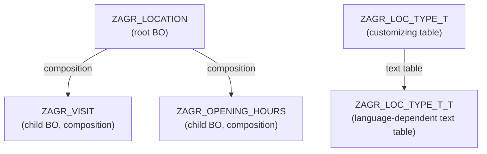

# Agora — Data Model

> **Version:** 3.1 | **Status:** AUTHORITATIVE

---

## Entity-Relationship Diagram (RAP Business Object Hierarchy)

All transactional entities use `sysuuid_x16` primary keys, generated by the RAP framework on Create (`%key` auto-fill in managed scenarios). `ZAGR_OPENING_HOURS` uses a compound key of `(LocationUuid, DayOfWeek)`.

---

## ABAP Domain Definitions

One fixed-value domain is defined. Location type is no longer a domain — it is driven by the customizing table `ZAGR_LOC_TYPE_T` (see below).

| Domain | Values | Description |
|---|---|---|
| `ZAGR_D_STATUS` | `VISITED`, `WISHLIST`, `CLOSED` | Lifecycle status; default value is `WISHLIST` |

---

## `ZAGR_LOCATION` (Root BO)

Physical HANA transparent table. Corresponds to CDS interface view `ZAGR_I_LOCATION`.

| Field | ABAP Type | Key | Notes |
|---|---|---|---|
| `LocationUuid` | `sysuuid_x16` | Yes | Generated by RAP framework on Create |
| `Name` | `abap.char(255)` | | NOT NULL |
| `LocType` | `abap.char(20)` | | FK to `ZAGR_LOC_TYPE_T`; NOT NULL |
| `Address` | `abap.string(0)` | | NOT NULL |
| `ZipCode` | `abap.char(10)` | | nullable |
| `City` | `abap.char(100)` | | NOT NULL |
| `Country` | `land1` | | NOT NULL; SAP standard country code domain `LAND1` (ISO 3166-1 alpha-2, 2 chars). Provides built-in F4 value help in Fiori. |
| `Website` | `abap.char(500)` | | nullable |
| `Status` | `abap.char(10)` | | Domain `ZAGR_D_STATUS`; NOT NULL; default `WISHLIST` |
| `Latitude` | `abap.dec(10,7)` | | nullable; resolved by auto-geocoding or manual input; used by Pinax |
| `Longitude` | `abap.dec(10,7)` | | nullable; resolved by auto-geocoding or manual input; used by Pinax |
| `GeoResolved` | `abap.char(1)` | | Boolean flag; `X` = coordinates were resolved by auto-geocoding; space = manual or unresolved |
| `PriceRating` | `abap.int1` | | nullable; CHECK 1–5 enforced via validation in behavior definition |
| `AmbienceRating` | `abap.int1` | | nullable; CHECK 1–5 |
| `QualityRating` | `abap.int1` | | nullable; CHECK 1–5 |
| `OverallScore` | `abap.dec(3,2)` | | nullable; application-computed and persisted on each MODIFY that changes any rating field |
| `CreatedAt` | `abap.utclong` | | RAP managed (`$self.created_at`) |
| `CreatedBy` | `abap.char(256)` | | RAP managed |
| `LastChangedAt` | `abap.utclong` | | RAP managed; serves as the **ETag master** field for optimistic locking |
| `LastChangedBy` | `abap.char(256)` | | RAP managed |
| `LocalLastChangedAt` | `abap.utclong` | | RAP managed; used internally for draft scenarios |

### Overall Score Computation

`overall_score = (price_rating + ambience_rating + quality_rating) / 3.0`

- Computed in **application code** inside the `MODIFY` method of `ZAGR_BP_LOCATION`, not as a HANA generated column.
- **ABAP null handling:** ABAP's initial value for numeric types is `0`, not NULL. The behavior implementation must explicitly check whether each rating field is at its initial value before computing the score. If any of the three rating fields is unset (initial value), `OverallScore` is set to null in the HANA column (the column allows NULL). Do **not** rely on ABAP arithmetic with initial values producing a meaningful result.
- Returns null if any dimension is unset — including for wish-list entries that typically have no ratings.
- Recalculated and stored on every `MODIFY` operation that includes `PriceRating`, `AmbienceRating`, or `QualityRating` in the changed field set.
- The Tholos "highest ranked" stat (`GET GetDashboardStats()`) excludes locations where `OverallScore IS NULL`.

### Geocoding Fields

`Latitude`, `Longitude`, and `GeoResolved` are populated by the geocoding flow described in R-013–R-017.

- Auto-geocoding is triggered in the `AFTER SAVE` phase of `ZAGR_BP_LOCATION` when a location is created or when address-relevant fields change (`Address`, `ZipCode`, `City`, `Country`), and `GeoResolved = X` is not already set or coordinates have been invalidated.
- The geocoding HTTP call is made from the behavior implementation using an HTTP client configured via a Communication Arrangement (Communication System + Communication User defined in BTP ABAP Environment).
- On success: `Latitude`, `Longitude` are written; `GeoResolved = X`.
- On failure: record is saved without coordinates; `GeoResolved` remains space; the location is surfaced with a warning indicator in the admin UI.
- When an admin manually sets `Latitude`/`Longitude` directly, `GeoResolved` is set to space to distinguish manual from auto-resolved coordinates. A subsequent `ReGeocode` bound action can re-trigger auto-geocoding and will set `GeoResolved = X` on success.
- Locations where both `Latitude` and `Longitude` are null, or where `Status = 'CLOSED'`, are excluded from the Pinax map view.

---

## `ZAGR_VISIT` (Child BO — Composition under Location)

Physical HANA transparent table. Compound key `(LocationUuid, VisitUuid)`.

| Field | ABAP Type | Key | Notes |
|---|---|---|---|
| `LocationUuid` | `sysuuid_x16` | Yes | FK to `ZAGR_LOCATION`; part of compound key |
| `VisitUuid` | `sysuuid_x16` | Yes | Generated by RAP framework on Create |
| `VisitedAt` | `abap.dats` | | NOT NULL; the calendar date of the visit |
| `Note` | `abap.string(0)` | | nullable |
| `AdminUserId` | `abap.char(256)` | | Stores the BTP IAS principal name of the admin who logged the visit. Set by the RAP behavior implementation using `cl_abap_context_info=>get_user_technical_name()` on Create. **Never exposed in the public CDS projection** `ZAGR_C_VISIT_PUB`. |
| `CreatedAt` | `abap.utclong` | | RAP managed |
| `LastChangedAt` | `abap.utclong` | | RAP managed; ETag master for this child entity |

### AdminUserId Privacy

`AdminUserId` is defined on the **interface** CDS view `ZAGR_I_VISIT` only. It is structurally excluded from the public consumption view `ZAGR_C_VISIT_PUB` — the field is not projected. This provides defense-in-depth: even if an unauthorized request reaches the public service binding, the field is architecturally absent from the OData response.

---

## `ZAGR_OPENING_HOURS` (Child BO — Composition under Location)

Physical HANA transparent table. Compound key `(LocationUuid, DayOfWeek)` — at most one record per day per location.

| Field | ABAP Type | Key | Notes |
|---|---|---|---|
| `LocationUuid` | `sysuuid_x16` | Yes | FK to `ZAGR_LOCATION`; part of compound key |
| `DayOfWeek` | `abap.int1` | Yes | 1 = Monday … 7 = Sunday; ISO 8601 weekday numbering |
| `ClosedToday` | `abap.char(1)` | | Boolean flag (`X` / space); location is closed on this day. When set, time fields are ignored. |
| `OpenTime1` | `abap.tims` | | nullable; start of first opening period |
| `CloseTime1` | `abap.tims` | | nullable; end of first opening period |
| `OpenTime2` | `abap.tims` | | nullable; start of second opening period (e.g. reopening after lunch break) |
| `CloseTime2` | `abap.tims` | | nullable; end of second opening period |
| `LastChangedAt` | `abap.utclong` | | RAP managed; ETag master for this child entity |

A day with no record in this table is treated as "opening hours not configured" — distinct from `ClosedToday = X`. Both time pairs are independently optional: a location open continuously (no break) uses only `OpenTime1`/`CloseTime1`. `OpenTime2`/`CloseTime2` are only relevant on split-day schedules.

Opening hours are part of the `Location` BO draft — edits are buffered in the draft table until the Location is activated.

---

## `ZAGR_LOC_TYPE_T` and `ZAGR_LOC_TYPE_T_T` (Customizing Tables)

Location type is not a fixed-value domain — it is stored in a client-dependent customizing table, extensible by admin users without code changes.

### `ZAGR_LOC_TYPE_T` (Type Master)

| Field | ABAP Type | Key | Notes |
|---|---|---|---|
| `LocType` | `abap.char(20)` | Yes | Technical key; uppercase; e.g. `RESTAURANT`, `COFFEEHOUSE`, `BAR`, `BAKERY` |
| `BaseColor` | `abap.char(7)` | | Base colour hex code (e.g. `#E63946`); selected via colour picker in the admin UI |

The two Pinax colour variants (bold/saturated for visited, light/pastel for wish-list) are **calculated at render time** from `BaseColor` by adjusting HSL saturation and lightness — they are not stored.

### `ZAGR_LOC_TYPE_T_T` (Language-Dependent Text Table)

| Field | ABAP Type | Key | Notes |
|---|---|---|---|
| `LocType` | `abap.char(20)` | Yes | FK to `ZAGR_LOC_TYPE_T` |
| `Spras` | `spras` | Yes | SAP language key |
| `Description` | `abap.char(100)` | | Display label in the given language; e.g. "Restaurant", "Café", "Bäckerei" |

Both tables are transport-managed under the `ZAGORA` package as client-dependent customizing (delivery class `C`).

---

## Changes from v2.0

| Area | Change |
|---|---|
| Namespace prefix | `ZAGORA_` → `ZAGR_` on all objects |
| `ZAGR_D_LOC_TYPE` domain | Removed — replaced by `ZAGR_LOC_TYPE_T` / `ZAGR_LOC_TYPE_T_T` customizing tables |
| `ZAGR_D_STATUS` | Added `CLOSED` as third status value |
| `ZAGR_LOCATION` | Added `ZipCode`, `Latitude`, `Longitude`, `GeoResolved` fields |
| `ZAGR_OPENING_HOURS` | New child BO composition under `ZAGR_LOCATION` |
| Geocoding | Coordinate resolution and `GeoResolved` flag logic documented in data model |
| Pinax exclusion | Locations with null coordinates or `Status = 'CLOSED'` excluded from map |
| v1.0 → v2.0 removals | `images` table, `refresh_tokens` table, social token columns, `password_hash` — all remain removed |
